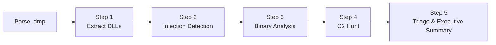
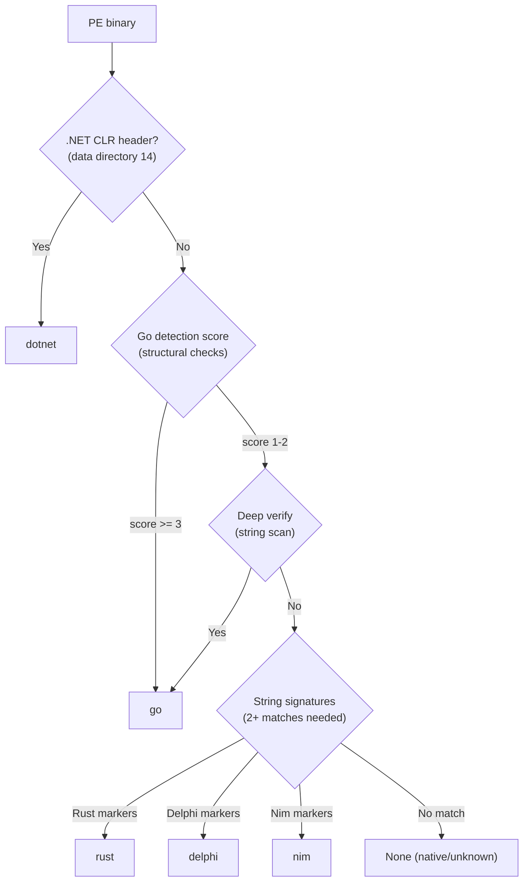
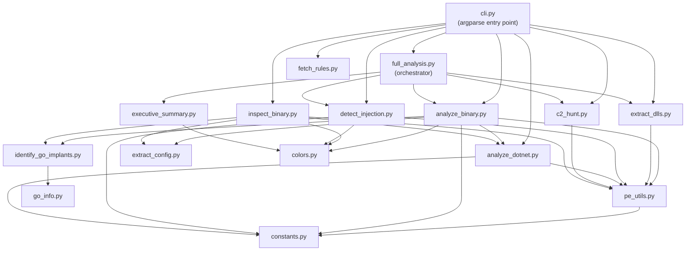
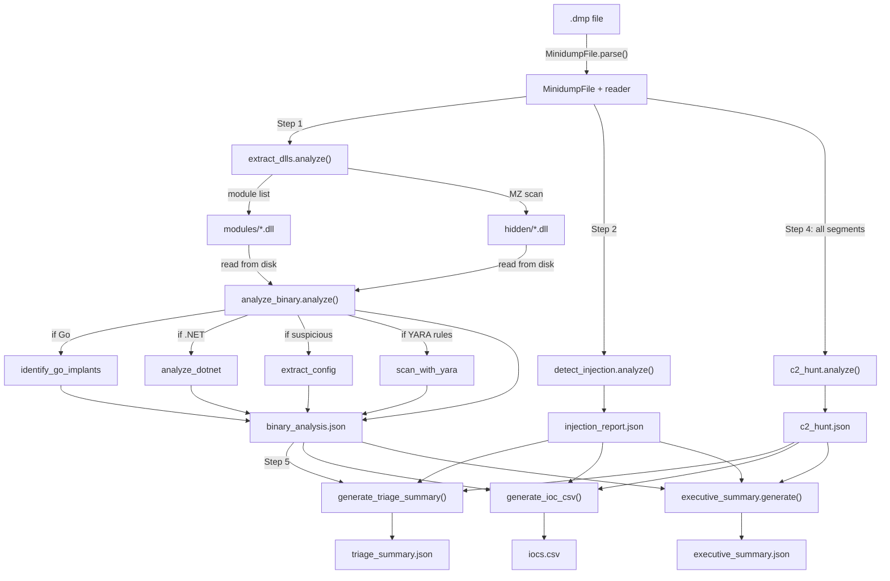

# MemDump Toolkit — Architecture

The memdump-toolkit is a forensic analysis pipeline for Windows minidump files. It parses the dump **once**, sharing a single `MinidumpFile` + reader across all modules, and exposes a 5-step `full` pipeline plus standalone commands for each step.

If you are new to memory forensics, think of a minidump as a photograph of a running process: it captures the code that was loaded, the data in memory, and a list of all the DLLs the process claimed to be using. This toolkit develops that photograph and looks for evidence that something malicious was hiding inside it.

---

## Table of Contents

0. [Background: Key Concepts for Non-Reversers](#0-background-key-concepts-for-non-reversers)
1. [Prerequisites & Libraries](#1-prerequisites--libraries)
2. [Full Pipeline Overview](#2-full-pipeline-overview)
3. [Step 1: DLL Extraction](#3-step-1-dll-extraction)
4. [Step 2: Injection Detection](#4-step-2-injection-detection)
5. [Step 3: Universal Binary Analysis](#5-step-3-universal-binary-analysis)
6. [Step 4: C2 Hunt Memory Scanning](#6-step-4-c2-hunt-memory-scanning)
7. [Step 5: Triage, Executive Summary & IOC Export](#7-step-5-triage-executive-summary--ioc-export)
8. [Language Detection & Dispatch](#8-language-detection--dispatch)
8.1. [Standalone Binary Inspection](#81-standalone-binary-inspection)
9. [Risk Scoring Breakdown](#9-risk-scoring-breakdown)
10. [How This Compares to Live-Process Scanners (pe-sieve / hollows_hunter)](#10-how-this-compares-to-live-process-scanners-pe-sieve--hollows_hunter)
11. [Detection Techniques We Could Borrow](#11-detection-techniques-we-could-borrow)
12. [Module Dependency Graph](#12-module-dependency-graph)
13. [Data Flow](#13-data-flow)

---

## 0. Background: Key Concepts for Non-Reversers

This section explains the core concepts you need to understand the rest of this document. If you already know what a PE file is, feel free to skip ahead.

### What is a minidump?

A minidump is a **snapshot (photograph) of a running Windows process**. When you "dump" a process, you capture:

- **The code loaded in memory** — every executable and DLL the process was using at that moment.
- **Data on the heap** — variables, strings, decrypted secrets, network buffers, and anything the program was working with.
- **The module list** — the operating system's official record of which DLLs are loaded and where they sit in memory.

Think of it as **freezing a crime scene** so you can examine it later. The process keeps running (or has already been killed), but you have an exact copy of everything that was in its memory. This toolkit examines that copy and looks for evidence of malicious activity.

The `minidump` Python library (by @skelsec) parses the dump format and gives us a `MinidumpFile` object plus a `reader` that can fetch bytes from any address in the dump.

### What is a PE file?

PE stands for **Portable Executable** — it is the file format Windows uses for executables (`.exe`) and libraries (`.dll`). Every PE file starts with a two-byte **magic signature**: the letters `MZ` (a historical reference to Mark Zbikowski, one of the original MS-DOS developers).

Think of a PE as a **shipping container with a manifest and cargo**:

- **The manifest (headers)** — describes what is inside: how many sections there are, when the file was compiled, whether it is a DLL or an EXE, whether it targets 32-bit or 64-bit Windows, and where execution should begin (the "entry point").
- **The cargo (sections)** — named regions containing the actual code and data (see below).

We use the `pefile` library to parse PE headers. It handles malformed and partially-paged-out PEs gracefully, which matters because memory-dumped binaries are often incomplete.

### What are PE sections?

Sections are **named regions inside a PE** file. Each section has a name and a set of permission flags (readable, writable, executable). The standard ones are:

| Section | Contains | Typical permissions |
| --- | --- | --- |
| `.text` | Executable machine code | Read + Execute |
| `.data` | Global variables (read/write) | Read + Write |
| `.rdata` | Read-only data: strings, constants, import tables | Read |
| `.rsrc` | Resources: icons, version info, embedded files | Read |
| `.reloc` | Relocation fixup data | Read |

**Why this matters for malware detection:** Legitimate software uses standard section names. Malware, especially packed malware, often has unusual section names like `.UPX0` (the UPX packer), `MPRESS1`, or random-looking names. A section that is simultaneously Readable + Writable + Executable (RWX) is suspicious because legitimate code almost never needs all three permissions — RWX sections are a hallmark of self-modifying or unpacking code.

### What are imports?

When a DLL or EXE needs to call a Windows function (like `CreateFile` to open a file, or `VirtualAlloc` to allocate memory), it declares that dependency in its **Import Address Table (IAT)**. The imports are essentially a shopping list of capabilities the binary needs from the operating system.

**Why this matters:** The imports tell you what a binary can do. For example, if you see a binary importing all three of these functions:

- `VirtualAllocEx` — allocate memory inside another process
- `WriteProcessMemory` — write bytes into another process's memory
- `CreateRemoteThread` — start a new thread inside another process

That is the **textbook process injection combo**. No legitimate software needs all three. The toolkit categorizes imports into threat categories like "process_injection", "credential_access", and "evasion" to flag dangerous combinations automatically.

### What is entropy?

Entropy is a **measure of randomness** on a scale from 0 to 8 (for byte data). Think of it as measuring how "compressed" or "scrambled" data looks:

| Entropy range | What it typically means |
| --- | --- |
| 0.0 - 1.0 | Mostly the same byte repeated (like a block of zeroes) |
| 4.0 - 5.0 | English text or structured data |
| 5.5 - 6.5 | Compiled machine code |
| 7.0 - 7.5 | Compressed data (ZIP, PNG) |
| 7.5 - 8.0 | Encrypted or strongly compressed data |

**Why this matters:** If a PE section has entropy above 7.0, the data inside is probably encrypted or packed. Malware authors encrypt their payloads to hide them from signature-based scanners. The toolkit flags sections with entropy above 7.2 as suspicious (the `shannon_entropy` function in `pe_utils.py` computes this).

### What is process injection?

Process injection is a technique where malware **inserts its own code into a legitimate, trusted process** (like `explorer.exe` or `svchost.exe`). Once injected, the malicious code runs inside the trusted process, which makes it:

- **Invisible to Task Manager** — it looks like normal Windows activity.
- **Invisible to the OS module list** — the operating system does not know the injected code is there, because it was never "properly" loaded as a DLL.
- **Only visible in a memory scan** — which is exactly what this toolkit does.

The toolkit detects injected code by scanning memory for PE files that are NOT in the module list (we call these "hidden PEs") and by looking for executable memory regions that do not belong to any known module.

### What is C2 (Command & Control)?

C2 is the **server that an implant (malware) phones home to** for instructions. The implant connects to the C2 server, receives commands (download a file, run a keylogger, spread to other machines), and sends results back.

C2 addresses can be:

- **Hardcoded in the binary** — visible in the PE's string data.
- **Decrypted at runtime** — only visible in memory after the implant has started running.

The second case is why memory dump analysis is so valuable: the C2 URL that was encrypted on disk is now sitting in plaintext on the heap. **Finding the C2 URL is the single most actionable indicator of compromise (IOC) for incident response** — you can block it at the network perimeter immediately.

### What is YARA?

YARA is a **pattern-matching language for malware researchers**. A YARA rule says: "If you see these specific bytes or strings in this combination, it is probably X malware family." Think of it as a **fingerprint database for malicious software**.

For example, a YARA rule for Cobalt Strike might look for the specific byte sequences that appear in Cobalt Strike's beacon DLL. If a binary matches, you know (with high confidence) exactly what tool the attacker was using.

The toolkit optionally loads YARA rules and scans every extracted binary against them. Rules can come from a user-specified directory (`--yara-rules /path`) or from rulesets fetched via `memdump-toolkit fetch-rules` (`--yara-rules auto` auto-discovers `~/.memdump-toolkit/rules/`). The scanner walks directories recursively, so nested ruleset structures work out of the box. Rules are compiled individually so one broken rule file does not prevent the rest from running.

### What are MITRE ATT&CK techniques?

MITRE ATT&CK is a **standardized catalog of attacker behaviors**, maintained by the MITRE Corporation. Every known technique has an ID:

| ID | Technique | Plain English |
| --- | --- | --- |
| T1055 | Process Injection | Hiding code inside another process |
| T1036 | Masquerading | Naming malware to look like a system file |
| T1071.001 | Web Protocols | Using HTTP/HTTPS for C2 communication |
| T1572 | Protocol Tunneling | Hiding C2 traffic inside legitimate protocols |

**Why this matters:** ATT&CK IDs are the universal language of incident response. When an analyst says "we observed T1055 and T1071.001", every other analyst in the industry knows exactly what happened. The toolkit maps every detected signal to ATT&CK technique IDs so that findings can be fed directly into detection engineering workflows.

### Why memory-dumped hashes don't match on-disk files

When you extract a DLL from a memory dump and hash it, the SHA-256 will **never** match the hash of the same DLL sitting on disk. This means you cannot look up memory-dumped hashes on VirusTotal, NSRL, or any other hash database and expect a match. This is not a bug — it is an inherent property of how Windows loads PE files into memory.

Three things change between the on-disk file and the in-memory image:

1. **Relocation (rebasing)**. Every PE has a "preferred base address" — the memory address where it was designed to load. When two DLLs want the same address (which happens constantly), the Windows loader **rewrites every absolute pointer** in the code to account for the new base address. This changes bytes throughout the `.text` and `.reloc` sections.

2. **Import Address Table (IAT) patching**. On disk, the IAT contains symbolic references (names or ordinals) to functions the binary needs. At load time, the loader **replaces every entry with the actual runtime address** of the resolved function. The entire `.rdata` section (or wherever the IAT lives) is different in memory.

3. **Page zeroing and partial paging**. The OS only pages in memory as it is accessed. Sections that were never touched may be **zeroed out** in the dump, while the on-disk file has real content there. Conversely, some pages may have been modified by runtime patches (hotpatching, hooks) that further change the content.

**Practical implication:** The toolkit computes and reports hashes for every extracted binary (they are useful for correlating across multiple dumps of the same process), but these hashes are **memory-image hashes**, not file hashes. To match against known-good databases like NSRL, use the `--known-good` option with a hash set built from memory images of trusted binaries, or rely on the toolkit's other signals (imports, strings, sections, YARA) for identification.

---

## 1. Prerequisites & Libraries

Before diving into the pipeline, it helps to know which external libraries do the heavy lifting and why each one exists. Some are required; others are optional but unlock additional detection capability.

### Required

| Library | What it does |
| --- | --- |
| `minidump` | Parses the Windows minidump format. Gives us a `MinidumpFile` object (module list, threads, memory info) and a `reader` for fetching raw bytes from any virtual address in the dump. We parse the dump once and share the reader across all pipeline steps. |
| `pefile` | Parses PE (Portable Executable) headers, sections, imports, exports, resources, and data directories. Chosen because it handles malformed and truncated PEs gracefully — critical for memory-dumped binaries where pages may be missing. Replaces all manual struct unpacking. |
| `rapidfuzz` | C-optimized Levenshtein edit distance. Used in injection detection to find DLL names that are suspiciously similar to real Windows DLLs (typosquatting detection, e.g., "kerne1l32.dll" vs "kernel32.dll"). We use it because it is orders of magnitude faster than a pure-Python implementation. |
| `rich` | Terminal formatting library. Used for colored output, tables (especially the ATT&CK mapping table in the executive summary), and panels. Makes the output readable for analysts reviewing results in a terminal. |

### Optional

| Library | What it unlocks |
| --- | --- |
| `yara-python` | YARA rule scanning. If installed and `--yara-rules` is provided (with an explicit path or `auto` to use `~/.memdump-toolkit/rules/`), every extracted binary is scanned against all `.yar`/`.yara` files found recursively. Rules are compiled individually so one broken file does not kill the whole scan. External variables (`filepath`, `filename`, etc.) are provided with sensible defaults so community rulesets work out of the box. Use `memdump-toolkit fetch-rules` to download community rulesets. |
| `dnfile` | .NET metadata parsing. Extracts assembly identity (name, version), type definitions, method definitions, P/Invoke (Platform Invoke) declarations, referenced assemblies, and embedded resources from .NET binaries. Falls back gracefully to string-based detection if not installed. Chosen because it is purpose-built for .NET PE parsing and handles the complex .NET metadata tables that `pefile` does not understand. |
| `cryptography` | X.509 certificate parsing for C2 hunt results. If installed, PEM certificates found in memory can be decoded to show subject, issuer, and validity dates. |

---

## 2. Full Pipeline Overview

The `full` command (in `full_analysis.py`) orchestrates five steps. The dump is parsed **once** at the top; the resulting `MinidumpFile` and `reader` objects are passed to each step. A `Tee` class captures all stdout to `full_report.txt` (with ANSI color codes stripped for the file copy).

| Step | Module | What it produces |
| --- | --- | --- |
| 1 | `extract_dlls.py` | `modules/` dir, `hidden/` dir, CSVs |
| 2 | `detect_injection.py` | `injection_report.json` |
| 3 | `analyze_binary.py` | `binary_analysis.json`, `suspicious_binaries.csv` |
| 4 | `c2_hunt.py` | `c2_hunt.json` |
| 5 | `full_analysis.py` + `executive_summary.py` | `triage_summary.json`, `iocs.csv`, `executive_summary.json` |

### Pipeline design principles

- **Single parse, shared reader**: The minidump is parsed exactly once. Every step receives the same `mf` (MinidumpFile) and `reader` objects, so no step re-parses the dump file.
- **Each step reads the previous step's output from disk**: Step 3 reads the PE files that Step 1 wrote to `modules/` and `hidden/`. This means Step 1 must complete before Step 3 can start.
- **All steps produce JSON reports**: Every step writes a structured JSON file that downstream steps (and the executive summary) can consume.

---

## 3. Step 1: DLL Extraction

**Module:** `extract_dlls.py`

### Purpose

Extracts every PE (Portable Executable) image from the dump and writes it to disk. There are two phases:

**Phase 1 — Listed modules:** Iterates the minidump's module list (the official OS record of loaded DLLs). For each module, reads the memory at the listed base address for the listed size, validates the MZ/PE header, and writes the binary to `output/modules/`. If the same DLL name appears more than once (loaded at different addresses), the duplicate gets a disambiguated filename like `ntdll_0x7ffe12340000.dll`.

**Phase 2 — Hidden PE scan:** Walks every memory segment in the dump. For each segment, checks whether the first bytes are `MZ` (the PE magic signature). If a valid PE header is found at an address that is NOT in the module list, this is a **hidden PE** — a binary that the operating system did not know about. Hidden PEs are the primary indicator of injected code. These are written to `output/hidden/`.

In plain English: Phase 1 collects everything the OS *admits* was loaded. Phase 2 finds everything the OS *did not know about*.

### Why it matters

Injected code (the malicious payload) is almost always hidden — it was manually loaded into memory by the attacker and never registered with the Windows loader. If we only looked at the module list, we would miss the actual implant.

### Implementation details

- **Library:** `minidump` for the module list and memory segment enumeration. `pefile` (via `pe_utils.check_pe_header` and `pe_utils.get_pe_info`) for PE validation.
- **Memory reading:** `read_module_memory` tries a single bulk read first; if that fails (pages not present in the dump), it falls back to page-by-page reading (4 KB at a time) and reports coverage percentage. `read_pe_full_image` handles hidden PEs that span beyond the containing memory segment.
- **Identity resolution:** For hidden PEs, we try to determine what the binary is by checking the PE export name, then falling back to version info fields (`OriginalFilename`, `InternalName`). Binaries with no identity at all are labeled "UNKNOWN" and are treated as higher priority.

### Extraction output

| File | Contents |
| --- | --- |
| `modules/*.dll` | Listed DLLs (memory-mapped copies) |
| `hidden/*.dll` / `hidden/*.exe` | Hidden PE images |
| `module_list.csv` | Inventory: name, base address, size, coverage, hashes, packed sections |
| `hidden_list.csv` | Inventory of hidden PEs with identity and hash |

---

## 4. Step 2: Injection Detection

**Module:** `detect_injection.py`

### Detection goal

Runs eight checks looking for signs that code was injected into the process. Each check produces findings tagged with a severity level (CRITICAL, HIGH, MEDIUM, LOW, INFO).

In plain English: Step 1 pulled out the binaries. Step 2 asks "do any of these look like they were planted here by an attacker?"

### The eight checks

| # | Check | What it detects | How | Severity |
| --- | --- | --- | --- | --- |
| 1 | **Typosquatting** | DLLs named almost-but-not-quite like real Windows DLLs | Levenshtein edit distance (via `rapidfuzz`) and homoglyph comparison against a list of ~100 known system DLLs. If a DLL named `kerne1l32.dll` is found, it gets flagged. When the legitimate DLL is also loaded, a page-by-page byte comparison measures similarity. | HIGH |
| 2 | **Heap-loaded modules** | DLLs loaded at heap memory addresses (not in the normal DLL address range) | Address range heuristic: on 64-bit Windows, DLLs normally load above `0x7F0000000000`. Anything below that is heap/private memory — DLLs there were likely manually mapped. The toolkit is bitness-aware (different ranges for x86 vs x64). | MEDIUM |
| 3 | **Duplicate modules** | The same DLL name loaded more than once at different addresses | Groups modules by filename. Duplicates are suspicious: attackers sometimes load a second copy of a DLL to get a "clean" copy without security hooks. | HIGH |
| 4 | **Hidden PE images** | PE files in memory that are not in the module list | Same scan as Step 1's Phase 2, but here we assign severity based on flags: unknown identity, heap region, suspicious entry point (0x200 is common in shellcode), Go binary detected, or large unknown binary. | HIGH-CRITICAL |
| 5 | **Untrusted paths** | Modules loaded from non-standard locations | Checks module paths against a list of trusted path fragments (`\windows\system32\`, `\windows\syswow64\`, etc.). Anything outside these paths is flagged. | INFO |
| 6 | **Thread outside modules** | Threads whose instruction pointer is not inside any known module | Reads each thread's context (register state) and checks whether RIP (on x64) or EIP (on x86) falls within a known module's address range. A thread executing outside all modules is likely running shellcode. | HIGH |
| 7 | **RWX memory regions** | Memory regions that are readable + writable + executable, outside known modules | Reads the `MemoryInfoList` stream from the dump and filters for `PAGE_EXECUTE_READWRITE` regions. Then runs 7-heuristic shellcode analysis: function prologues, API hashing patterns, NOP sleds, code density, embedded PEs, statistical classification (pe-sieve approach), and capstone disassembly validation. | HIGH-CRITICAL |
| 8 | **Suspicious imports** | Untrusted modules importing dangerous API combinations | Parses the import table of every untrusted module and categorizes the functions (process injection, credential access, evasion, etc.). The `process_injection` combo (`VirtualAllocEx` + `WriteProcessMemory` + `CreateRemoteThread`) is an automatic HIGH. | MEDIUM-HIGH |

### Shellcode analysis (Check 7, in detail)

When an RWX region is found, `analyze_shellcode()` runs seven heuristics on the content:

1. **Prologue check** — looks for known shellcode start sequences in the first 16 bytes (e.g., `cld; call $+5` or `sub rsp, X; mov rbp, rsp`).
2. **Pattern scan** — searches for common shellcode patterns: API hashing routines (rotate-XOR loops that resolve function addresses at runtime), `GetProcAddress` call patterns, and stack-based string construction.
3. **NOP sled detection** — looks for runs of NOP instructions (`0x90 0x90 0x90...`), which are padding that shellcode uses to make jumps more reliable.
4. **Code density heuristic** — measures what percentage of bytes in the first 4 KB are non-null. Shellcode has high byte diversity; empty pages are mostly zeroes.
5. **Embedded PE detection** — searches for an MZ signature inside the RWX region, which indicates a reflective loader (shellcode that loads a PE directly from memory without touching disk).
6. **Statistical classification (pe-sieve approach)** — analyzes byte frequency distribution over the first 4 KB to classify the region as code, obfuscated (XOR-encoded), or encrypted. Three sub-detectors: **CodeMatcher** (CALL opcode frequency > 1%, null ratio > 10%, byte diversity > 50), **ObfuscatedMatcher** (most frequent byte != 0x00, byte diversity > 85 — catches XOR-encoded shellcode in the 4.0-6.0 entropy range that the density heuristic misses), **EncryptedMatcher** (entropy > 7.0 or > 6.0 with uniform distribution).
7. **Disassembly validation (optional, requires `capstone`)** — disassembles the first 1 KB with capstone (x86-64 mode) and measures the valid instruction ratio. If > 60% of bytes decode to valid instructions with > 10 instructions total, the region contains real executable code. Degrades gracefully when capstone is not installed.

### Injection output

| File | Contents |
| --- | --- |
| `injection_report.json` | All findings with severity, type, and details |

---

## 5. Step 3: Universal Binary Analysis

**Module:** `analyze_binary.py`

### Analysis scope

Analyzes every extracted PE binary (from both `modules/` and `hidden/`) for malicious indicators, regardless of what programming language the binary was written in. This is the "universal" analysis — language-specific deep analysis (Go, .NET) is dispatched as a sub-step.

In plain English: Step 1 extracted the files. Step 2 checked for injection patterns. Step 3 opens each file and asks "what IS this thing, and is it dangerous?"

### Three-tier filtering

Not every binary deserves the same level of scrutiny. The toolkit uses three tiers to avoid wasting time on benign system DLLs while giving maximum attention to suspicious files:

| Tier | Which binaries | What runs |
| --- | --- | --- |
| **Tier 0: SKIP** | Resource-only DLLs — zero code sections, zero imports, entry point at 0 (like icon libraries or language packs) | Nothing. Skipped entirely. |
| **Tier 1: LIGHTWEIGHT** | Modules from trusted paths (`\Windows\System32\`, etc.) | Timestamp check, packer artifact scan, language identification. If nothing suspicious is found, stop here. |
| **Tier 2: FULL** | Everything else: hidden PEs, untrusted paths, anything that showed signals in Tier 1 | All checks: imports, section anomalies, entropy analysis, language-specific deep analysis, config extraction, YARA scanning (including offensive tool attribution via tagged rules). |

### What the full analysis covers

1. **PE metadata** — Uses `pefile` to extract: compilation timestamp, number of sections, DLL vs EXE, 32-bit vs 64-bit, entry point, image size, export name, version info.

2. **Timestamp anomaly detection** — Flags PEs with impossible compilation timestamps: epoch zero (0x00000000), max value (0xFFFFFFFF), dates before 2000, or dates in the future. Malware authors often forge timestamps to mislead analysts (a technique called "timestomping", MITRE T1070.006).

3. **Packer artifact detection** — Searches section names and header bytes for known packer/crypter signatures: UPX, ASPack, Themida, VMProtect, PECompact, MPRESS, and others. Packers compress or encrypt a binary so that its real code is only visible at runtime — legitimate software sometimes uses packers, but they are much more common in malware.

4. **Language identification** — Determines what programming language was used to build the binary (see [Language Detection & Dispatch](#8-language-detection--dispatch) for details).

5. **Import analysis** — Parses the import table with `pefile` and categorizes imported functions into threat categories: process injection, credential access, evasion, memory manipulation, code loading. The category definitions live in `constants.py` under `SUSPICIOUS_IMPORTS`.

6. **Section anomaly detection** — Flags sections with: RWX permissions (readable + writable + executable), WX permissions (writable + executable), non-standard names that do not start with a dot, and zero-size executable sections.

7. **YARA-based tool attribution** — When `--yara-rules` is provided (explicit path or `auto` for `~/.memdump-toolkit/rules/`), scans the binary against all compiled YARA rules found recursively. Matches tagged with `offensive_tool` are promoted to tool attributions (e.g., Cobalt Strike, Metasploit). Language-specific tool signatures remain built-in: Go tools in `constants.py` under `KNOWN_TOOLS`, .NET tools in `DOTNET_OFFENSIVE_TOOLS`.

8. **High entropy detection** — Calculates Shannon entropy for each section using the `shannon_entropy` function in `pe_utils.py`. Sections with entropy above 7.2 and size above 4 KB are flagged as potentially encrypted or packed content.

9. **Language-specific deep analysis** — If the binary is identified as Go, dispatches to `identify_go_implants.py` for Go-specific analysis. If .NET, dispatches to `analyze_dotnet.py`. (See [Language Detection & Dispatch](#8-language-detection--dispatch) below.)

10. **Config/IOC extraction** — For binaries with suspicious signals, runs `extract_config.py` to search for embedded network indicators: IP addresses, URLs, hostnames, named pipes, hex-encoded encryption keys, and User-Agent strings.

11. **Risk scoring** — Combines all findings into a 0-100 risk score (see [Risk Scoring Breakdown](#9-risk-scoring-breakdown)).

### Binary analysis output

| File | Contents |
| --- | --- |
| `binary_analysis.json` | Full analysis results for all binaries with risk >= 10 |
| `suspicious_binaries.csv` | Flat summary: filename, language, risk score, severity, risk factors, hashes |

---

## 6. Step 4: C2 Hunt Memory Scanning

**Module:** `c2_hunt.py`

### Scanning scope

Scans ALL memory segments in the dump — not just PE binaries, but heap, stack, and data segments too — looking for runtime C2 (Command & Control) artifacts. This catches indicators that were **decrypted at runtime** and exist only in memory, never on disk.

In plain English: Steps 1-3 analyzed the executables. Step 4 searches the raw memory for the addresses, keys, and credentials that those executables were using at the moment the dump was taken.

### Why memory scanning matters

Many modern implants encrypt their configuration (C2 URLs, encryption keys, certificates) and only decrypt them when needed. The on-disk binary might contain nothing but encrypted blobs. But in a memory dump, those values are sitting in plaintext on the heap. This step finds them.

### What it scans for

| Category | Pattern | How it filters noise | Why it matters |
| --- | --- | --- | --- |
| **URLs** | `http(s)://`, `wss://`, `socks4://`, `tcp://`, `udp://` | Drops known system domains (Microsoft, Google, certificate authorities), SOAP/XML schema URLs, PKI infrastructure URLs. Keeps cloud C2 patterns (AWS ELB, ngrok, Cloudflare tunnels), non-standard ports, bare IPs, and suspicious path keywords (`/beacon`, `/stager`, `/callback`). | C2 communication endpoints. |
| **Bare hostnames** | Cloud provider subdomains, `.onion`, `.i2p` | Only keeps hostnames matching cloud C2 patterns or suspicious TLDs. | C2 infrastructure without a full URL. |
| **IP:port combos** | `\d+.\d+.\d+.\d+:\d+` | Drops loopback (127.x), link-local (169.x), broadcast (255.x), version-number-like IPs (all octets < 10). | Network connections, often to C2. |
| **Private keys** | PEM-encoded RSA/EC/DSA/OPENSSH private keys | Extracts complete PEM blocks from `-----BEGIN` to `-----END`. | mTLS authentication to C2 — finding a private key in memory means the implant was authenticating with certificates. |
| **Certificates** | PEM-encoded X.509 certificates | Same PEM block extraction. | Related to mTLS / C2 authentication. |
| **Named pipes** | `\\.\pipe\<name>` | No filtering — named pipes in memory are almost always significant. | Inter-process communication, often used by C2 frameworks (Cobalt Strike uses named pipes extensively). |
| **User-Agent strings** | `Mozilla/4.x` or `Mozilla/5.x` followed by at least 30 characters | Splits results into **heap** (likely implant — the implant stored this UA string for use in HTTP requests) and **system DLL** (likely benign — baked into `winhttp.dll` or similar). The split is based on memory address: below `0x7F0000000000` = heap, above = DLL. | Implants spoof browser User-Agent strings to blend in with normal web traffic. |

### Scanning implementation

- **Library:** No external library needed beyond `minidump` for memory reading and Python's `re` for regex matching.
- **Scanning:** Iterates every memory segment in the dump. Each segment is read (up to 10 MB cap per segment, 50 MB max segment size) and scanned with compiled regex patterns. Results are accumulated in a `defaultdict` that deduplicates by value while tracking all addresses where each value was found.
- **Noise filtering:** The `_filter_url` function applies a 10-step whitelist/blacklist pipeline. URLs must pass all filters to be included. The `_NOISE_DOMAINS` frozenset contains ~60 known-benign base domains (Microsoft, Google, certificate authorities, standards bodies). Cloud C2 patterns (AWS ELB, ngrok, Cloudflare Tunnels) are always kept regardless of other filters.

### C2 hunt output

| File | Contents |
| --- | --- |
| `c2_hunt.json` | All C2 indicators: URLs, hostnames, IP:ports, PEM keys, certificates, named pipes, User-Agents — each with memory addresses where found |

---

## 7. Step 5: Triage, Executive Summary & IOC Export

**Modules:** `full_analysis.py` (triage + IOC export) and `executive_summary.py` (executive summary + ATT&CK mapping)

### Reporting scope

This step takes the raw findings from Steps 1-4 and transforms them into three outputs designed for different audiences:

1. **Triage Summary** (`triage_summary.json`) — a prioritized view of CRITICAL and HIGH findings, cross-referencing injection detection, binary analysis, and C2 hunt results. Designed for the analyst who needs to quickly understand "what is the worst thing in this dump?"

2. **Executive Summary** (printed to terminal + `executive_summary.json`) — plain-English prose, per-binary verdicts, MITRE ATT&CK technique mapping, C2 infrastructure summary, and recommended response actions. Designed for communicating findings to non-technical stakeholders and feeding technique IDs into detection engineering.

3. **IOC CSV** (`iocs.csv`) — a flat file of every indicator of compromise, ready for SIEM ingestion (hash, URL, IP, hostname, named pipe, offensive tool name, User-Agent).

### Executive Summary: How it works

The executive summary generator in `executive_summary.py` does four things:

**1. Sorts suspicious binaries by "implant significance"** — not raw risk score. A Go implant identified as ligolo-ng with 11 capabilities leads over a .NET loader that happens to score higher on generic API heuristics. The ranking function combines tool match count + capability count, then uses risk score as a tiebreaker.

**2. Generates plain-English verdicts** for each suspicious binary. For example:
> "Go DLL — identified as ligolo-ng — with Internal Proxy, Protocol Tunneling, SOCKS Proxy and 8 more capabilities — found hidden in memory (not in module list)"

**3. Maps all signals to MITRE ATT&CK techniques** using the `ATTACK_MAP` dictionary, which contains 100+ mappings from internal signal names to `(technique_id, technique_name, tactic)` tuples. This covers:

- Go capabilities (websocket_c2 -> T1071.001, socks_proxy -> T1090.001, etc.)
- .NET suspicious categories (process_injection -> T1055, reflective_loading -> T1620, etc.)
- Universal signals (packer_artifacts -> T1027.002, rwx_sections -> T1055.012, etc.)
- C2 hunt signals (c2_url -> T1071.001, c2_private_key -> T1588.004, etc.)
- Known tool families (Cobalt_Strike -> S0154, Mimikatz -> S0002, etc.)

Techniques are sorted by kill chain phase (Execution -> Persistence -> ... -> Command and Control -> Exfiltration).

**4. Generates recommended response actions** based on what was found:

- `BLOCK` all C2 URLs/hostnames at network perimeter
- `REVOKE` certificates if private key material was found in memory
- `ISOLATE` affected host from network
- `HUNT` for SHA256 hash across the fleet
- `MAP` ATT&CK techniques to detection rules

**Library:** `rich` for formatted terminal output. The ATT&CK mapping is rendered as a `rich.Table` with columns for Tactic, ID, Technique Name, and Evidence. The terminal width is forced to 120 columns because stdout may be redirected through the `Tee` class (not a real TTY).

### IOC CSV: What goes in it

The IOC export aggregates indicators from all pipeline steps into a flat CSV with columns `type`, `value`, `context`, `source`:

- **From binary analysis:** MD5/SHA256 hashes of suspicious binaries, offensive tool names, embedded URLs/IPs/hostnames from config extraction, named pipes, User-Agent strings.
- **From C2 hunt:** C2 URLs, hostnames, IP:port combos, named pipes, heap User-Agents, private key count.
- **From injection detection:** Typosquatting DLL names.

Values are deduplicated by (type, value) tuple, sanitized (CSV formula injection prevention via leading-character escaping, control characters stripped, length capped at 500), and written with `csv.QUOTE_ALL` for safe SIEM import.

### Triage and summary output

| File | Contents |
| --- | --- |
| `triage_summary.json` | Critical + High findings, cross-referenced from all steps |
| `executive_summary.json` | Verdicts, ATT&CK techniques, C2 infrastructure, recommended actions |
| `iocs.csv` | Flat IOC list for SIEM ingestion |
| `full_report.txt` | Complete terminal output (ANSI stripped) |

---

## 8. Language Detection & Dispatch

**Module:** `analyze_binary.py` → `classify_language()`

The `classify_language` function identifies what programming language was used to compile a PE binary. This matters because different languages have different artifacts and require different analysis techniques.

### Detection methods

| Language | Detection method | Deep analyzer |
| --- | --- | --- |
| **.NET** | Structural check: data directory entry 14 (COM_DESCRIPTOR / CLR header) has a non-zero virtual address and size. This is fast, reliable, and requires no string scanning. Uses `pefile` to read the data directory. | `analyze_dotnet.py` — uses `dnfile` for metadata (assembly name, types, P/Invoke declarations) and string scanning for obfuscator signatures, offensive tool markers, and suspicious API patterns. |
| **Go** | Score-based: checks the first 4 KB for Go-specific section names (`.symtab`, `.noptrdata`), build ID strings (`Go build`, `go.buildid`), and pclntab (program counter line table) signatures. A score of 3+ is definitive. Scores of 1-2 trigger a deeper scan of the full binary for Go runtime strings. | `identify_go_implants.py` — extracts Go module paths, identifies known offensive tools (ligolo-ng, Sliver, Chisel, Merlin, etc.), catalogs capabilities (C2 protocols, pivoting, credential theft, encryption), and extracts network IOCs. |
| **Rust** | String signatures: looks for Rust-specific strings (panic messages, runtime paths) in the first 2 MB. Requires 2+ matches to avoid false positives. | No deep analyzer yet (language tag is set, universal analysis applies). |
| **Delphi** | String signatures: Borland/Embarcadero runtime strings. 2+ matches required. | No deep analyzer yet. |
| **Nim** | String signatures: Nim runtime markers. 2+ matches required. | No deep analyzer yet. |

### .NET analysis details

When a binary is identified as .NET, `analyze_dotnet.py` runs:

1. **CLR flags check** — reads the CLR header flags to determine if the assembly is IL-only (pure .NET) or mixed-mode (contains native code — unusual and suspicious).
2. **Metadata extraction (via `dnfile`)** — extracts the assembly name/version, all type definitions (class names), method count, P/Invoke (Platform Invoke) declarations (which tell you what native Windows APIs the .NET code calls), referenced assemblies, native DLL references, and embedded resources.
3. **P/Invoke classification** — categorizes each P/Invoke declaration against the same threat categories used for native imports (process injection, credential access, evasion, etc.). A .NET binary importing `VirtualAllocEx` via P/Invoke is just as suspicious as a native binary.
4. **String-based analysis** — scans for obfuscator signatures (ConfuserEx, SmartAssembly, Dotfuscator, .NET Reactor, etc.), known offensive tool markers (SharpHound, Rubeus, Seatbelt, etc.), and suspicious .NET API usage patterns (reflection, dynamic code generation, process manipulation).
5. **Framework assembly suppression** — assemblies from the .NET framework itself (`mscorlib`, `System.Core`, etc.) naturally contain "suspicious" APIs. These get their risk score capped at 0 to avoid false positives.

### Go analysis details

When a binary is identified as Go, `identify_go_implants.py` runs:

1. **Module path extraction** — finds the Go module path (e.g., `github.com/nicocha30/ligolo-ng`) embedded in the binary. Custom (non-standard-library) paths are separated out as more interesting.
2. **Known tool matching** — checks module paths against a database of known offensive Go tools.
3. **Capability cataloging** — searches for string patterns indicating specific capabilities: SOCKS proxy, port forwarding, credential theft, Kerberos/NTLM authentication, WebSocket C2, encryption, and many more. Capabilities are split into "strong" (high confidence) and "weak" (contextual).
4. **Network IOC extraction** — pulls out embedded URLs, User-Agent strings, and named pipe names.

### Language detection principles

- **.NET detection is structural** (CLR header check) — fast, zero false positives.
- **Go detection is score-based** — structural checks first, string fallback second. This avoids misidentifying C/C++ binaries that happen to contain "Go" as a substring.
- **Other languages use 2-of-N string matching** — a single string match is not enough to claim a language (too many false positives), but two or more is reliable.

## 8.1. Standalone Binary Inspection

**Module:** `inspect_binary.py` | **Command:** `memdump-toolkit inspect <binary>`

The `inspect` command provides deep analysis of a single binary file without requiring a minidump. This is useful for triaging suspicious files found outside a memory dump context (e.g., files recovered from disk, downloaded samples, or extracted payloads).

### Pipeline

1. **Read & hash** — compute MD5 and SHA256.
2. **Language detection** — simplified version of `classify_language()`: checks Go buildinfo magic, .NET CLR header, then string signatures for Rust/Delphi/Nim. Falls back to "native".
3. **Dispatch to language-specific analyzer:**
   - **Go** → `go_info.analyze()` — extracts module path, Go version, dependencies, source files, functions by package, and capabilities.
   - **.NET** → `analyze_dotnet.analyze_dotnet_binary()` — extracts assembly metadata, P/Invoke declarations, obfuscator signatures, offensive tool markers, and suspicious APIs. Does not require a minidump.
   - **Other** (Rust, Delphi, Nim, Native) → `extract_config.extract_config_from_binary()` — scans for embedded network indicators, crypto material, and C2 configuration.
4. **YARA scan** — always runs if `--yara-rules` is provided. Matches include ruleset source attribution (e.g., "signature-base", "GCTI").
5. **Unified report** — colored terminal output with all findings, plus optional JSON export.

### Difference from pipeline analysis

| Aspect | `inspect` (standalone) | `analyze` (pipeline Step 3) |
| --- | --- | --- |
| Input | Any binary file on disk | Extracted DLLs from a minidump |
| Context | No memory dump context | Full dump context (injection signals, C2 hunt, module list) |
| Risk scoring | Per-analyzer (Go capabilities, .NET risk) | Composite score from all signals |
| Use case | Quick triage of a single file | Comprehensive dump investigation |

---

## 9. Risk Scoring Breakdown

**Function:** `analyze_binary.compute_risk_score()`

Every binary gets a composite risk score from 0 to 100, built by adding points for each suspicious signal detected. The score determines triage priority.

| Signal | Points | Example |
| --- | --- | --- |
| **Offensive tool match** (YARA tagged, Go, or .NET) | +40 | YARA rule tagged `offensive_tool` matches Cobalt Strike |
| **Go capabilities** (5+) | +35 | SOCKS proxy + port forwarding + credential theft + WebSocket C2 + encryption |
| **Go capabilities** (3-4) | +25 | Three significant capability categories |
| **Go capabilities** (1-2) | +15 | One or two capabilities |
| **YARA rule match** (non-tool) | up to +30 | Any non-tool YARA rule fires (min(count × 10, 30)) |
| **Process injection imports** (native) | +20 | `VirtualAllocEx` + `WriteProcessMemory` + `CreateRemoteThread` |
| **.NET obfuscators** | +20 | ConfuserEx, .NET Reactor, etc. |
| **.NET process injection P/Invoke** | +20 | P/Invoke declarations for injection APIs |
| **Packer artifacts** | +15 | UPX, Themida, VMProtect section names |
| **RWX sections** | +15 | Any section with Read+Write+Execute permissions |
| **Credential access imports** | +15 | `OpenProcessToken`, `LsaRetrievePrivateData`, etc. |
| **High entropy sections** | +10 | Section entropy > 7.2, size > 4 KB |
| **.NET evasion P/Invoke** | +10 | `AmsiScanBuffer`, `EtwEventWrite` (AMSI/ETW bypass) |
| **Embedded network IOCs** | +10 | URLs or named pipes found in config extraction |
| **Memory manipulation imports** | +5 | `VirtualAlloc` + `VirtualProtect` (without the process injection combo) |
| **Timestamp anomaly** | +5 | Date before 2000 or in the future (but not epoch zero/max) |

The score is capped at 100. Severity labels are derived from the score:

| Score | Severity | Meaning |
| --- | --- | --- |
| 60+ | CRITICAL | Almost certainly malicious — investigate immediately |
| 30-59 | HIGH | Strong indicators — should be reviewed |
| 10-29 | MEDIUM | Some suspicious signals — review if time permits |
| 0-9 | LOW | Probably benign |

### Scoring design principles

- **Tool matches dominate** (+40) because a known tool identification is near-certain evidence of attack tooling.
- **Import analysis is contextual** — `VirtualAlloc` alone is +5 (many legitimate programs use it), but the process injection combo (`VirtualAllocEx` + `WriteProcessMemory` + `CreateRemoteThread`) is +20.
- **Scoring is additive** — a packed binary (+15) with process injection imports (+20) and high entropy (+10) scores 45 (HIGH), which is a reasonable risk level for something that looks packed and injects code.

---

## 10. How This Compares to Live-Process Scanners (pe-sieve / hollows_hunter)

This section explains how our toolkit relates to two well-known live-process scanning tools, to help you understand what we can and cannot detect.

### hollows_hunter

[hollows_hunter](https://github.com/hasherezade/hollows_hunter) is a **live-process scanner**. You run it on a Windows machine, and it enumerates ALL running processes and scans each one for in-memory malware. It uses **pe-sieve** as its detection engine.

### pe-sieve

[pe-sieve](https://github.com/hasherezade/pe-sieve) is the core scanner that does the heavy lifting. For each process, it:

1. **Opens the live process** and reads its memory directly.
2. **For each loaded DLL, reads the SAME DLL from disk** (the original file) and **compares them byte-by-byte**. Any bytes that differ in the code sections are **inline hooks** — the attacker patched the code to redirect execution flow (e.g., making a security function silently return "OK" instead of doing its real check).
3. **Checks the Import Address Table (IAT)** — if a function pointer was changed to point somewhere unexpected, that is an **IAT hook** (the attacker redirected API calls to their own code).
4. **Scans all executable memory regions** that do not belong to any known module — this catches shellcode and manually-mapped DLLs that were never registered with the Windows loader.
5. **Uses statistical analysis** (entropy + byte frequency + opcode ratios) to classify unknown memory regions as: legitimate code, obfuscated (XOR-encoded), or encrypted.
6. **Walks thread call stacks** to find threads that are executing from shellcode or unknown memory regions.
7. **Dumps suspicious modules** and reconstructs their PE headers for offline analysis.

### Key difference: we work on minidumps (post-mortem), pe-sieve works on live processes

| Capability | Our toolkit (minidump) | pe-sieve (live process) |
| --- | --- | --- |
| **Inline hook detection** | Cannot do this. We do not have the original on-disk DLLs to compare against. | Yes — byte-by-byte comparison of in-memory vs on-disk. |
| **IAT hook detection** | Cannot do this. Same reason — no on-disk reference to compare. | Yes — checks if function pointers were redirected. |
| **Full address space** | Some pages may be missing from the dump (not all pages are captured). | Full access to the live process's memory. |
| **Offline analysis** | Yes — we can analyze dumps from machines we no longer have access to. This is the primary incident response use case. | No — requires a live, running process on the target machine. |
| **Deep static analysis** | Yes — we can spend as much time as needed on language detection, capability extraction, config parsing, YARA scanning, and MITRE ATT&CK mapping. We are not constrained by scan speed. | Limited — must be fast enough to scan many processes without impacting system performance. |
| **C2 extraction from heap** | Yes — we scan all memory segments for decrypted C2 URLs, keys, and certificates. | No — pe-sieve focuses on code integrity, not data content. |

In plain English: pe-sieve is a patrol officer doing a quick but thorough walk-through of a building while people are still inside. We are the forensic investigators who arrive after the scene has been photographed and preserved — we cannot see who was standing where, but we can take our time examining every piece of evidence in detail.

---

## 11. Detection Techniques We Could Borrow

These are concrete improvements we could implement, inspired by pe-sieve's detection capabilities.

### 1. Headerless PE recovery

**The gap:** Our hidden PE scan (in `extract_dlls.py` and `detect_injection.py`) only finds PEs by looking for the `MZ` magic bytes at the start. If an attacker zeroes out the first two bytes of an injected DLL, we miss it entirely.

**What pe-sieve does:** Its `ArtefactScanner` finds PEs even when the MZ header has been zeroed out, by searching for:

- Section characteristic bit patterns (`0x60000020` = `CODE|EXECUTE|READ`) — these appear in the section table, which is deeper in the PE header and attackers rarely zero out.
- `FILE_HEADER.Machine` field values (`0x014C` for x86, `0x8664` for x64) — these identify the PE architecture.
- Section name strings like `.text` — these appear in the section table entries.

**What we would need to implement:** A secondary scan pass that searches each memory segment for section table patterns rather than just MZ magic. This would catch injected DLLs where the attacker deliberately erased the magic signature.

### 2. Statistical shellcode classification — IMPLEMENTED

**Status:** Implemented in heuristic #6 of `analyze_shellcode()`. See [Shellcode analysis (Check 7, in detail)](#shellcode-analysis-check-7-in-detail) for the full description.

The implementation adds pe-sieve-inspired byte frequency analysis with three sub-detectors (CodeMatcher, ObfuscatedMatcher, EncryptedMatcher) that classify memory regions based on byte distribution. This closes the XOR-encoded shellcode blind spot (entropy 4.0-6.0). Additionally, heuristic #7 adds optional capstone-based disassembly validation to confirm whether a region contains real executable instructions.

### 3. Thread call stack analysis

**The gap:** In `detect_injection.py` Check 6, we only check each thread's instruction pointer (RIP on x64, EIP on x86). If a thread is currently executing inside `kernel32.dll` (legitimate) but was *called from* shellcode, we miss it.

**What pe-sieve does:** It walks each thread's call stack using the Windows `StackWalk64` API and checks every return address on the stack. If any return address points into unknown memory (not inside a known module), the thread was called from suspicious code.

**What we would need to implement:** Parse the stack memory from the dump and walk the frame chain (using RBP/RSP frame pointers or unwind data) to extract return addresses. Then check each return address against the module list. This would catch threads that called *into* shellcode and have since returned, or threads that are currently in a legitimate API call but were *invoked* from injected code.

### 4. Section unpacking detection

**The gap:** We detect packed binaries by looking for packer signatures in section names (UPX, Themida, etc.) and high entropy. But if an attacker uses a custom packer with no known signature, we might miss it.

**What pe-sieve does:** For listed modules, it compares the on-disk PE sections with the in-memory versions. A section that was all-zeros on disk but contains non-zero data in memory was filled at runtime — this is the hallmark of runtime unpacking.

**What we could approximate:** Since we do not have the on-disk originals, we cannot do a direct comparison. However, we could heuristically detect unpacking by checking if a PE has sections with very low raw data size (on-disk size) but large virtual size (in-memory size) combined with high entropy in the memory content. This pattern — "small on disk, large and encrypted in memory" — strongly suggests the section was unpacked at runtime.

---

## 12. Module Dependency Graph

### Key observations

- **`pe_utils.py` is the shared foundation.** Every module that touches PE data imports from it: hashing, entropy, PE header parsing, import extraction, YARA scanning, memory reading, and CSV writing. All PE parsing goes through `pefile`.
- **`constants.py` holds all detection signatures.** Packer signatures, suspicious import categories, language markers, system DLL names, trusted path fragments, shellcode patterns — all centralized so they can be updated without touching detection logic.
- **`full_analysis.py` is the orchestrator.** It does not contain detection logic — it calls each module's `analyze()` function in sequence and generates the triage summary.
- **`executive_summary.py` is output-only.** It reads results from other steps and generates human-readable summaries and ATT&CK mappings. It has no detection logic.
- **`inspect_binary.py` is a standalone single-binary inspector.** It provides the `inspect` CLI command — auto-detects language, dispatches to the appropriate analyzer (Go, .NET, or config extraction), runs YARA, and prints a unified colored report. Unlike `analyze_binary.py` (which operates within the full pipeline on extracted DLLs), `inspect_binary.py` works on any binary file directly.
- **`colors.py` provides TTY-aware colored output.** Backed by the `rich` library, it exports formatting functions (`critical`, `high`, `info`, `dim`, `bold`, `severity`, `banner`) and a shared `Console` instance. Respects `NO_COLOR` and `FORCE_COLOR` environment variables. The `Tee` class in `full_analysis.py` strips ANSI codes when writing to the report file.
- **`fetch_rules.py` manages YARA ruleset lifecycle.** Handles cloning/updating 6 public YARA ruleset repositories (signature-base, yara-rules, GCTI, reversinglabs, ESET, Elastic) into `~/.memdump-toolkit/rules/`. The `resolve_yara_dir()` function translates `--yara-rules auto` into the concrete rules path. The `inspect` and `full` commands consume these rules.

---

## 13. Data Flow

This diagram shows the complete data flow through the pipeline, from input to output.

### Data flow principles

- **The dump is parsed once** (`MinidumpFile.parse()`). The resulting reader object provides access to any virtual address in the dump.
- **Step 3 reads files from disk**, not from memory. Steps 1 writes PE binaries to the filesystem; Step 3 reads them back. This means Step 1 must complete before Step 3 starts.
- **Step 4 (C2 Hunt) scans raw memory**, not extracted binaries. It accesses the reader directly to scan heap, stack, and data segments.
- **Step 5 cross-references everything.** The triage summary, IOC export, and executive summary all consume results from Steps 2, 3, and 4.
- **Language-specific analyzers are dispatched conditionally.** Go analysis only runs on Go binaries. .NET analysis only runs on .NET assemblies. Config extraction only runs on binaries with suspicious signals. YARA only runs if a rules directory was provided. This keeps analysis time proportional to the number of interesting binaries.
